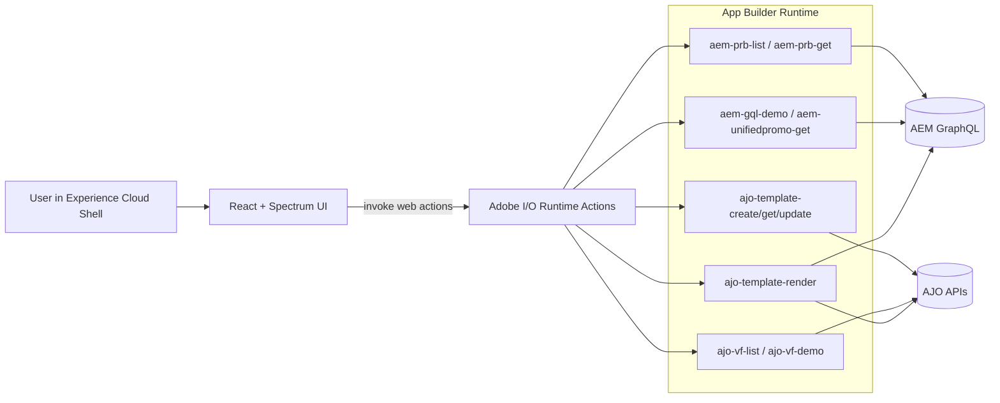

# Content Orchestration Studio: Architecture Map

## 1) Current State (Today)

### Goal
Provide an internal composition + preview studio for AJO email templates, combining:
- AJO templates and Visual Fragments (VF)
- AEM Content Fragments (CF) via GraphQL
- PRB context for content and labeling

### Logical Architecture



### Current Request/Response Pattern
1. UI selects PRB and template.
2. UI composes modules (VF + optional CF bindings) into canonical template HTML.
3. UI calls `ajo-template-render`.
4. Render action:
- fetches or receives template HTML
- stitches/normalizes AJO fragments
- resolves AEM binding values
- returns `renderedHtml` + diagnostics (`vfDiag`, `stitchReport`, warnings, perf)
5. UI iframe renders preview + diagnostics tabs.

### Current Strengths
- Fast inner loop for template composition and QA.
- Strong debug surface for render fidelity issues.
- Clear separation between UI and action adapters.

### Current Gaps
- No AEP audience simulation/qualification signal in preview.
- No audience size estimation in authoring loop.
- No conditional content scenario matrix by audience segment/persona.

## 2) Future State (Next State): Add AEP-Aware Preview

### Product Intent
Layer in AEP so content authors can:
- choose target audience(s) and see estimated audience counts
- preview conditional content decisions per audience/persona
- compare variant rendering outcomes before activation

### Target Architecture

```mermaid
flowchart LR
  U[User] --> UI[Studio UI: Composition + Audience Panel]
  UI --> ORCH[Orchestration Runtime Actions]

  subgraph Core["Existing Core"]
    AJOA[AJO Template + VF APIs]
    AEMA[AEM GraphQL APIs]
  end

  subgraph AEP["New AEP Layer"]
    SEG[AEP Segmentation/Audience APIs]
    EST[AEP Audience Estimate Service]
    PROF[AEP Profile/Identity (optional sample profiles)]
    DEC[Decisioning/Offer APIs (optional phase)]
  end

  ORCH --> AJOA
  ORCH --> AEMA
  ORCH --> SEG
  ORCH --> EST
  ORCH --> PROF
  ORCH --> DEC

  ORCH --> RESP[Unified Preview Payload]
  RESP --> UI
```

### New Runtime Capability Slices
1. `aep-audience-search`
- Search/list candidate audiences or segment definitions.
- Return IDs, labels, freshness metadata.

2. `aep-audience-estimate`
- Given audience ID, return estimated qualified population.
- Cache short-lived estimates for UI responsiveness.

3. `aep-qualification-preview`
- Given template + audience (or profile sample), return qualification flags and rule traces.
- Purpose: explain why a variant appears.

4. `ajo-template-render` (extended)
- Accept `audienceContext` and `profileContext`.
- Evaluate conditional blocks with AEP context.
- Return `variantDiagnostics`:
  - selected branches
  - excluded branches
  - unresolved audience predicates

### UI Additions
1. Audience Panel (left/top)
- Audience picker
- Estimated audience count
- Freshness/status badge (e.g., estimate age)

2. Scenario Matrix
- Run preview against multiple audiences/personas side-by-side.
- Compare differences in modules/branches/claims.

3. Explainability Drawer
- For each conditional region: expression, resolved inputs, chosen path.

### Unified Preview Contract (Proposed)
```json
{
  "renderedHtml": "<html>...</html>",
  "audience": {
    "id": "aud-123",
    "name": "High Intent Shoppers",
    "estimatedQualified": 182340,
    "estimatedAt": "2026-02-12T08:30:00Z"
  },
  "qualification": {
    "qualified": true,
    "ruleTrace": []
  },
  "variantDiagnostics": {
    "selectedBranches": [],
    "excludedBranches": [],
    "unresolvedPredicates": []
  },
  "stitchDiagnostics": {},
  "perf": {}
}
```

## 3) Suggested Rollout (Incremental)

### Phase 1: Audience Visibility
- Add audience picker + estimate API integration.
- Keep render behavior unchanged.

### Phase 2: Context-Aware Preview
- Extend render action with `audienceContext`.
- Return branch diagnostics but keep current preview UX intact.

### Phase 3: Scenario Compare
- Multi-audience preview matrix + diff view.
- Persist common scenarios per PRB/template.

### Phase 4: Decisioning Depth (Optional)
- Integrate offer/decision policies where relevant.
- Add policy traceability in diagnostics.

## 4) Non-Functional Considerations

- Security: service-to-service creds for AEP APIs isolated to runtime actions; never exposed to UI.
- Performance: parallelize AJO + AEM + AEP fetches where possible; add bounded caches by audience/template hash.
- Reliability: graceful degradation if AEP services fail (preview still renders with explicit warning state).
- Observability: correlate preview requests with a request ID across UI and all actions.
